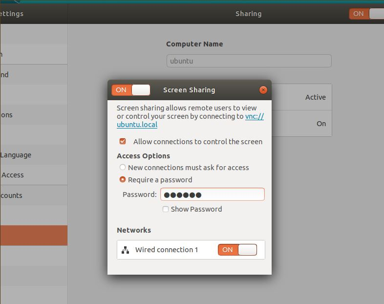
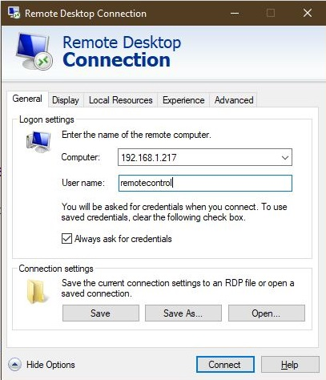
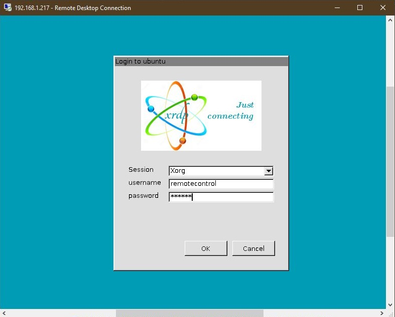
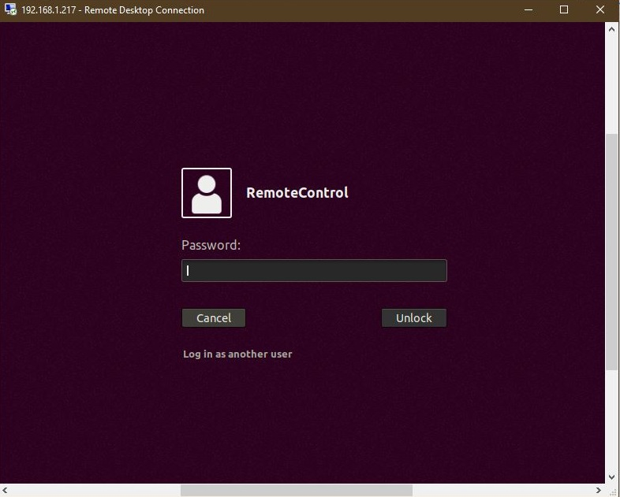

# Hướng dẫn cài đặt remote desktop bằng XRDP

## Install

### Firstly, Install Gnome and Xfce:

```bash
sudo apt update
sudo apt install ubuntu-desktop

sudo apt update
sudo apt install xubuntu-desktop
```

### Install XRDP

``` bash
sudo apt install xrdp 
```
### Check status in Systemd
``` bash
sudo systemctd status xrdp
```
### Add xrdp user to the group
``` bash
sudo adduser xrdp ssl-cert
```

### Restart xrdp service in Systemd

``` bash
sudo systemctl restart xrdp
```

### Configuring Firewall
Xrdp use port 3389 so following the command:
``` bash
sudo ufw allow 3389
```

### Install some option

``` bash
sudo apt-get install xorgxrdp-hwe-18.04
sudo apt-get install xserver-xorg-core
sudo apt-get -y install xserver-xorg-input-all
```

### Turn on screen sharing

<p align="center">
  
</p>

### Before try to connect, restart your computer

``` bash
reboot
```
## Connect

### Try to connect

<p align="center">
  
</p>

### Input password

<p align="center">
  
</p>

### Login user

<p align="center">
  
</p>

## Fix black screen

### You should log out your user before your connection

## Fix blue screen

### Download install-xrdp-3.0.sh in this repository

[install-xrdp-3.0.sh](install-xrdp-3.0.sh)

### Run that sh file

``` bash
chmod 777 install-xrdp-3.0.sh
./install-xrdp-3.0.sh
reboot
```


